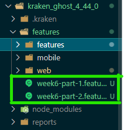

# Bienvenidos al repositorio de la materia pruebas automatizadas del grupo numero 24 el cual esta compuesto por

* Jorge A. Romero Gutierrez
* Camilo Zuleta (Manifestó retiro de la maestría)
* Leonardo Bustamante
* Kevin Maldonado

# Entrega semana 8

Escenarios a los que se les aplicaría VRT:

### 1. Escenarios obtenidos de una exploración manual y que posteriormente fueron automatizados implementando pruebas E2E
* [Funcionalidades y escenarios](https://github.com/jaromerog12/manual_automated_testing_kraken/wiki/Escenarios)

### 2. Funcionalidades a las que se les aplicará VRT
* [Funcionalidades y escenarios](https://github.com/jaromerog12/manual_automated_testing_kraken/wiki/VRT-iteraci%C3%B3n-1)

### 3. Ejecutar pruebas manuales automatizadas, E2E y VRT
* [Manual](https://github.com/jaromerog12/manual_automated_testing_kraken/wiki/Ejecutar-pruebas-iteraci%C3%B3n-1)

### 4. Incidencias
* [incidencias](https://github.com/jaromerog12/manual_automated_testing_kraken/issues)

# Entrega semana 7

<pre> Para la presente semana se trabajó con 3 integrantes, debido a que el compañero 
Camilo Zuleta manifestó que se retiraba del proceso </pre>

### Version a probar 

Ghost 3.41.1 puerto 2368

### Escenarios de test implementando generación de datos a priori, pseudoaleatorios y dinámicos.

Aca encontraras el listado de los casos implementados junto con el patron de cgenración de datos usado
* [Listado de escenarios](https://github.com/jaromerog12/manual_automated_testing_kraken/wiki/Escenarios)

Con este instructivo podras replicar en tu equipo la ejecución de las pruebas e2e con cypress
* [Ejecutar escenarios](https://github.com/jaromerog12/manual_automated_testing_kraken/wiki/Ejecutar-escenarios)

### Incidencias
* [incidencia](https://github.com/jaromerog12/manual_automated_testing_kraken/issues)

### Reporte

Para ver el reporte sobre esta semana, debe navegar a la [wiki](https://github.com/jaromerog12/manual_automated_testing_kraken/wiki) del repositorio y en la sección de la semana 7 encontrara toda la información necesaria

# Entrega semana 6

Impacto de la ejecución de los escenarios de pruebas de ***kraken*** en la nueva versión de ghost 4.44.0 y ***pupeteer*** para la versión 3.41.1 debido a que la entrega pasada se presentó con una versión superior a la 4.44.0

|Features afectadas|Funcionalidad|escenarios afectados|
| :-: | :-: | :-: |
|Todas|Login|20|
|pages, post y tags|Seleccionar opción del sidebar|12|
|pages y posts|Presionar botón crear nuevo item|2|
|pages y posts|Encontrar nombre de los items creados|2|
|pages y posts|Validar items en un lista|pages: 2, posts: 1|
|pages y posts|Seleccionar botón para actualizar un item|4|
|pages y posts|Seleccionar textarea - excerpt para actualizar en un item|2|
|pages y posts|Seleccionar botón para eliminar un item|2|
|pages y posts|Seleccionar menú de estados de un item|pages: 2, posts: 1|
|Posts|Hacer click en botón confirmar para publicar un posts|1|
|Tag|Seleccionar botón guardar tag|1|
|Tag|Seleccionar path al momento de crear un tag|1|
|Tag|Seleccionar la lista de tags|1|
|Tag|Seleccionar un tag específico aleatoriamente|1|
|Design|Separan el menú principal y el secundario de la funcionalidad del diseño y se lo pasan a uno nuevo llamado navigation|4|
|Design|Seleccionar item creado en navbar|2|
|Design|Seleccionar item creado en navegación secundaria, esta fué movida al footer|1|
|General|Seleccionar botón que permite expandir menú accordion del título|1|
|General|Seleccionar input para asignar título|1|
|General|Seleccionar el elemento que contiene el título en la home page|1|
|General|Seleccionar elemento de título y descripción de la metadata para su validación|1|
|General|Seleccionar elemento de título y descripción de facebook para su validación|1|

Escenarios que se utilizarán para aplicar ***VRT***:

***Todos los escenarios serán ejecutados en kraken.***

|#|Feature|Scenario|
| :-: | :-: | :-: |
|1|General|update facebook|
|2|General|update metadata|
|3|General|update title|
|4|General|update Twitter|
|5|Page|Show only page by status|
|6|Page|Show only pages by status and author|
|7|Posts|Create new post with draft status|
|8|Posts|Show only posts by status and author|
|9|Tag|Create new tag|
|10|Tag|Delete tag|

Ejecutar escenarios para las diferentes versiones de ghost:

1. Ejecutar Ghost en las versiones 3.41.1 y 4.44.0
    -Requisitos previos:

        * NodeJS: version: 14.21.3
        * Tener instalado docker en su máquina

### Ghost v 4.44.0 
<pre>
    Docker:
        1. Ejecutar el siguiente comando en la terminal de comandos de su SO
        docker run -d -e url=http://localhost:3002 -p 3002:2368 --name ghost_4.44.0 ghost:4.44.0
        2. Probar que el contenedor de ghost haya subido en el puerto especificado:
        en su navegador de preferencia dirigirse a la url http://localhost:3002
        3. Debe poder visualizar la página de home de ghost 
</pre>

### Ghost v 3.41.1
<pre>
    Docker:
        1. Ejecutar el siguiente comando en la terminal de comandos de su SO
        docker run -d -e url=http://localhost:2368 -p 2368:2368 --name ghost_3.41.1 ghost:3.41.1
        2. Probar que el contenedor de ghost haya subido en el puerto especificado:
        en su navegador de preferencia dirigirse a la url http://localhost:2368
        3. Debe poder visualizar la página de home de ghost 
</pre>

Luego de verificar que ghost esté corriendo, se debe dirigir a la url: http://localhost:<<puerto>>/ghost/#/signin y crear un usuario y una contraseña.
Estos datos deben ser reemplazado en el archivo properties.json en las llaves USERNAME y PASSWORD.

Imágen de la versión 4.44.0 de ghost

Después de haberse logueado, se debe navegar en la plataforma para remover el splash de bienvenida que solo aparece una sola vez:

2. Descargar el repo de la rama ***master***
3. Se encontrarán 2 carpetas que contienen los escenarios de kraken para ambas versiones de ghost:
    
    * ***kraken***: Ejecutar escenarios para la versión 3.41.1 de ghost
    * ***kraken_ghost_4_44_0***: Ejecutar escenarios para la versión 4.44.0 de ghost
4. Posicionados en la raíz de cada una de las carpetas ejecutar: ***npm install***

5. Ejecutar los escenarios:

- dentro de las carpetas del ***punto 3*** dirigirse a la ruta  ***features/features***, allí se almacenan los .feature de manera temporal con el fin que no se ejecuten todos en el mismo instante, debido a que se presentan problemas de rendimiento en la máquina y fallan los tests. Teniendo encuenta ese contexto, hay que mover los .feature archivo por archivo a la ruta ***features*** e ir ejecutandolos, lo cual ejecutará todos los escenarios que tenga esa feature, aún de esta manera podrían fallar algunos tests, en este caso toca ejecutar la feature pero escenario a escenario, por ejemplo comentandolos y dejando el que se va a probar.

***Los archivos que contienen los escenarios que serán utilizados para VRT se llaman week6-part-1 y week6-part-2.
[Ejecutar prueba para VRT](#pruebas_vrt)***

- Luego de esa verificación/creación y mover la feature a la ruta especifica, ejecutar el siguiente comando en la raiz de las carpetas principales:

<code>npx kraken-node run</code>

#### <b>Ejecutar y obtener insumo para pruebas VRT</b>
- Teniendo en cuenta los pasos para [ejecutar los escenarios para las diferentes versiones de ghost ](#ejecutar-pruebas-vrt) y antes de ejecutar el comando para correr las pruebas, se debe tener en cuenta lo siguiente:

     
    1. Dentro de las carpetas principales ***kraken y kraken_ghost_4_44_0*** eliminar el contenido de una subcarpeta llamada reports (de no existir, esta se creará al ejecutar la prueba).

    

    2. Mover los archivos week6-part-1 y week6-part-2 a la ruta <carpeta_raiz>/features

    

Posterior a los 2 puntos anteriores, se procede a [ejectutar la prueba](#ejecutar_escenarios). Los archivos week_XYZ pueden ser ejecutados al tiempo. Lo recomendable es uno a uno.

<b>Insumo para pruebas ***VRT***</b>

1. Dirigirse a la ruta  <carpeta_raiz>/reports y allí encontrá unas carpetas con con nombres extraños (hash). Usualmente crea una carpeta por archivo week_XYZ.feature ejecutado, lo cual, haría que la carpeta reports solo tenga 2 subcarpetas.

2. Algunas veces kraken genera unas carpetas que tienen un reporte general (deben ser excluidas o eliminadas) y además las carpetas con los escenarios. Las carpetas que se deben tomar en cuenta para el siguiente paso, deben tener la siguiente estructura interna:

Donde cada carpeta subrayada con verde es un escenario que se ejecutó en el archivo week6_XYZ.feature

En caso de algún error al momento de la ejecución de los archivos week_XYZ.feature, se debe devolver a la [consideración 1](#consideracion1) del presente manual.

***Solo debe continuar al paso 3 cuando las pruebas sean exitosas***

3. Luego de identificar las carpetas que contienen la ejecución de los escenarios, se debe crear una carpeta de nombre ghost_3_41_1 o ghost_4_44_0 de acuerdo a la versión donde se hayan ejecutado las pruebas, estas carpetas serán los datos de entrada para las pruebas ***VRT***.

Dentro de esta deben estar las carpetas generadas de la ejecución de los archivos week6_XYZ.feature (ver paso 4). Es decir, la carpeta ghost_XYZ deberá contener 10 subcarpetas que serían los escenarios ejecutados entre los 2 archivos week6_XYZ.feature, quedando de la siguiente manera:

	
### Ejecución de la herramienta Resemble JS
	
1. De acuerdo al paso 3 mencionado anteriormente, mover las carpetas ghost_3_41_1 y ghost_4_44_0 (las cuales deben contener internamente las carpetas con nombres extraños (hash), cada uno con sus archvos .json ) a la ruta resemble/jsonfiles/ 
	

2. validar que la carpeta /resemble/results/ ese vacia, de no ser asi eliminar todo lo que este adentro
	

3. Ubicados en la carpeta Resemble, ejecutamos los comandos npm install (en caso de no instalar las depedencias correctamente, ejecutar el comando npm install playwright y npm install resemblejs) 

4. ejecutamos el comando node index.js desde la carpeta resemble
	

5. Una vez terminado el proceso, vamos a la carpeta result dentro de la carpeta resemble e internamente abrimos el nombre de la carpeta nombrada con la fecha actual.
	

6. Internamente dentro de la carpeta mencionada en el paso 5, abrimos el archivo report.html en un navegador y evaluamos el resultado
	

### Reporte entrega semana 6

1. Dirigirse a la sección Wiki del repositorio ( https://github.com/jaromerog12/manual_automated_testing_kraken/wiki )
	
2. Visualizar la sección de "Entrega semana 6" y revisar cada item
	

***Nota***: En este vinculo encontrara toda la documentacion, el video, junto con informacion relevante acerca de las herramientas.

### Puppeter

Los 10 escenarios seleccionados para la ejecutar puppeter en version `3.41.1` son

|#|Feature|Scenario|
| :-: | :-: | :-: |
|1|General|update facebook|
|2|General|update metadata|
|3|General|update title|
|4|General|update Twitter|
|5|Page|Show only page by status|
|6|Page|Delete page|
|7|Page|Create page|
|8|Page|Edit page|
|9|Tag|Create new tag|
|10|Tag|Delete tag|

### Instalacion de pupeter

La instalacion es la misma que la indicada en la semana 5, sin embargo tiene dos cambios:
- Se debe contar con la ultima version disponible de node.js para este caso se utilizo la version `18.16.0.`, Para realizar esta instalacion se recomienda utilizar las intrucciones para lanzar el contenedor de esta version en la parte de arriba, seccion Ghost v 3.41.1

- Ahora debe ubicarse en la ubciacion `puppeeter/v3.42` para correr el comando `node index.js` en la terminal

# Entrega semana 5

### Instalacion de pupeter

#### Requerimientos

- Tener instalado de manera local el CMS ghost, para esto existen dos alternativas:
	- La primera es realizar una instalacion manual de Ghost segun indica su documentacion, que se encuentra en el siguiente [enlace](https://ghost.org/docs/install/local/ "Link").

	- La segunda es utilizando un contenedor de docker, para poder realizar la instalacion usando un contenedor debe ejecutar el siguiente comando en su terminal
`docker run -d -e url=http://localhost:3002 -p 3002:2368 --name ghost_4.44.0 ghost:4.44.0`

**Nota**: Se recomienda utilizar la segunda opcion, ya que evita la instalacion de mas componentes. Sin embargo para utilizarala debe contar con una instalacion funcionando de docker en su maquina.

#### Guia de ejecucion

1. Clonar el repositorio o hacer un fork al repositorio.
2. En la terminal de comandos de su preferencia y dirijase donde se encuentra el repositositorio, luego ubiquese en la carpeta **puppeteer**.
3. Realice la instalacion de los paquetes del proyecto utilizando el comando 
`npm install ` en la terminal, se recomienda correr este comando con permisos de Administrador.
4. Durante la instalacion de ghost, se le solicito crear un usuario y contraseña, para la administracion del contenido. Estos datos deben agregarse en el archivo `config.json` que se encuentra en la raiz de la carpeta **puppeter**.
5. Para ejecutar los test de puppeteer se necesita estar en la carpeta **puppeteer** y ejecutar por consola `node index.js` con eso correran los test.

#### Instalacion de Kraken
<pre>Versiones utilizadas:
- Node: 14.21.3
- ghost: 3.41.1
</pre>
1. Clonar el repositorio o hacer un fork al repositorio.
2. En la terminal de comandos de su preferencia y dirijase donde se encuentra el repositositorio, luego ubiquese en la carpeta **kraken**.
3. Realice la instalacion de los paquetes del proyecto utilizando el comando 
`npm install ` en la terminal, se recomienda correr este comando con permisos de Administrador.
4. Para ejecutar las pruebas utilice el siguiente comando:
`npx kraken-node run`
<pre>
A tener en cuenta:
- Los archivos feature se encuentran en el path kraken/features/features debido a que si se intentan ejecutar todos los archivos al tiempo, muchas veces falla.
De presentarse este caso, se debe intentar ejecutar archivo por archivo.
Para que los archivos puedan ser ejecutados se deben reubicar los .feature en el path kraken/features y ejecutar el comando anteriormente mencionado.
- En algunas ocasiones también sucede que si se ejecutan todos los escenarios de una feature, el test falla. Para este caso toca ejecutar escenario a escenario
</pre>

#### Funcionalidades y Escenarios de pruebas, estos son utilizados para ambas herramientas ***kraken y pupeteer***

|  Funcionalidad | Nombre escenarios de pruebas    | Descripcion escenarios de pruebas                                                                                                      |
| ------------ |---------------------------------|----------------------------------------------------------------------------------------------------------------------------------------|
|  General | Actualizar titulo y descripción | Se debe autenticar en la aplicacion e  ingresar en la pagina de configuracion, despues  se debe actualizar el titulo y la descripción. |
|  General | Actualizar metadatos            | Se debe autenticar en la aplicacion e  ingresar en la pagina de configuracion, despues  se debe actualizar algun metadato disponible.  |
|  General | Actualizar Facebook             | Se debe autenticar en la aplicacion e  ingresar en la pagina de configuracion, despues  se debe actualizar facebook.                   |
|  General | Actualizar twitter              | Se debe autenticar en la aplicacion e  ingresar en la pagina de configuracion, despues  se debe actualizar twitter.                    |

|  Funcionalidad | Nombre escenarios de pruebas    | Descripcion escenarios de pruebas                                                                                           |
| ------------ | ------------                    | ------------                                                                                                                |
|  Diseño | Crear nuevo elemento de menu    | Se debe autenticar en la aplicacion e  ingresar en la pagina de diseño, despues  se debe agregar un nuevo elemento en el menu. |
|  Diseño | Crear nuevo elemento de submenu | Se debe autenticar en la aplicacion e  ingresar en la pagina de diseño, despues  se debe agregar un nuevo elemento en el submenu |
|  Diseño | Eliminar elemento de menu       | Se debe autenticar en la aplicacion e  ingresar en la pagina de diseño, despues  se debe eliminar un elemento en el menu.   |
|  Diseño | Eliminar elemento de submenu    | Se debe autenticar en la aplicacion e  ingresar en la pagina de diseño, despues  se debe eliminar un elemento en el submenu |

|  Funcionalidad | Nombre escenarios de pruebas  |  Descripcion escenarios de pruebas  |
| ------------ | ------------ |------------ |
|  Paginas |  Crear nueva página| Se debe autenticar en la aplicacion, seleccionar pages en el sidebar, despues  se debe agregar una nueva página, se debe agregar titulo y contenido. Por ultimo se debe dar en el boton publicar.|
|  Paginas |  Actualizar página |  Se debe autenticar en la aplicacion, seleccionar pages en el sidebar, seleccionar la pagina a editar, modificar el titulo o contenido. Por ultimo se debe dar en el boton publicar.|
|  Paginas |  Eliminar página | Se debe autenticar en la aplicacion, seleccionar pages en el sidebar, seleccionar la pagina a eliminar, por ultimo dar clic en eliminar y confirmar la operación.|
|  Paginas |  Mostrar pagina por estado | Se debe autenticar en la aplicacion, seleccionar pages en el sidebar, se debe seleccionar el filtro por estado y luego realizar el filtrado.|
|  Paginas |  Mostrar pagina por autor | Se debe autenticar en la aplicacion, seleccionar pages en el sidebar, se debe seleccionar el filtro por autor y luego realizar el filtrado.|

|  Funcionalidad | Nombre escenarios de pruebas  |  Descripcion escenarios de pruebas  |
| ------------ | ------------ |------------ |
|  Post |  Crear nuevo post con estado publicado | Se debe autenticar en la aplicacion, seleccionar post en el sidebar, despues  se debe agregar una nuevo post, se debe agregar titulo y contenido. Por ultimo se debe dar en el boton publicar. |
|  Post | Crear nuevo post con estado borrador |  Se debe autenticar en la aplicacion, seleccionar post en el sidebar, despues  se debe agregar una nuevo post, se debe agregar titulo y contenido. NO se debe dar en el boton publicar.|
|  Post |  Actulizar post | Se debe autenticar en la aplicacion, seleccionar post en el sidebar, despues  se debe seleccionar el post a modificar, se edita el titulo o contenido. Por ultimo se debe dar en el boton publicar, en caso de querer publicar los cambios en caso contrario omitase. |
|  Post |  Eliminar post | Se debe autenticar en la aplicacion, seleccionar post en el sidebar, despues  se debe seleccionar el post a eliminar, por ultimo se debe confirmar la eliminacion.|
|  Post |  Filtrar post por estado y autor | Se debe autenticar en la aplicacion, seleccionar post en el sidebar, se debe seleccionar el filtro por estado o autor y luego realizar el filtrado.|

|  Funcionalidad | Nombre escenarios de pruebas  |  Descripcion escenarios de pruebas  |
| ------------ | ------------ | ------------ |
|  Tags |  Crear tag | Se debe autenticar en la aplicacion, seleccionar tags en el sidebar, despues  se debe agregar una nuevo tag, se debe diligenciar los campos. Por ultimo se debe dar en el boton guardar.|
|  Tags |  Eliminar Tag | Se debe autenticar en la aplicacion, seleccionar tag en el sidebar, despues  se debe seleccionar el tag a eliminar, por ultimo se debe confirmar la eliminacion. |

### Entrega semana 4

Para la entrega del reporte del uso de las herramientas Monkey Cypress y Rippuppet, los invito a navegar a la wiki de nuestro proyecto:

URL: https://github.com/kevin96uniandes/pruebas_automatizadas_equipo24/wiki

En la sección derecha de la wiki podras encontrar las paginas correspondientes al reporte seccionado por herramienta usada, te invitamos a que revises cada una

